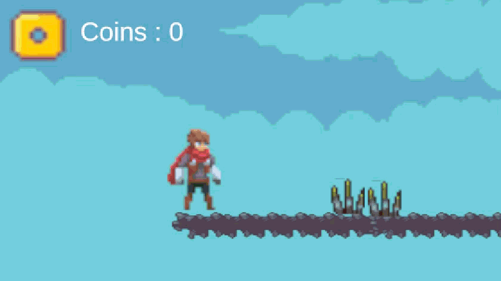
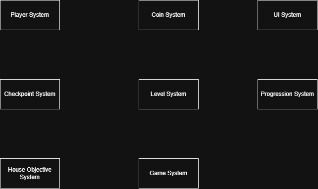

# 🏠 House Seeker

  

---

# 📖 About the Game

**House Seeker** is a 2D platformer game developed using Unity and C#. Players control a character who must collect coins while navigating platforms and overcoming obstacles to achieve the goal of purchasing a house.

Throughout the level, players can discover and activate checkpoints. If the player fails or falls, they respawn at the last activated checkpoint instead of restarting from the beginning.

The game combines platforming, coin collection, checkpoint-based progression, and exploration into a single gameplay experience.

---

# 🎮 Gameplay

Players control a character navigating a 2D platforming environment while collecting coins.

Coins contribute toward the game's main objective: purchasing a house. Along the way, players encounter checkpoints that serve as respawn locations.

When the player activates a checkpoint, it becomes the latest respawn point. If the player subsequently fails or falls, they respawn at that checkpoint and can continue their journey without restarting the entire level.

The gameplay focuses on platform navigation, coin collection, checkpoint progression, and reaching the main objective.

---

# 👥 Team

| Name      | Role                           |
| --------- | ------------------------------ |
| Christopher Immanuel Sunjoto | Game Programmer, Game Designer |

---

# 💻 My Contribution

As a **Game Programmer and Game Designer**, I was responsible for implementing gameplay systems and designing the core gameplay experience.

### Programming Contributions

* Implemented player movement and controls
* Developed the coin collection system
* Implemented the coin counter UI
* Developed the checkpoint activation system
* Implemented player respawning at the last activated checkpoint
* Integrated checkpoint functionality with player progression
* Implemented gameplay interactions
* Implemented assets from itch io

### Game Design Contributions

* Designed the core gameplay loop
* Established coin collection as the main objective
* Designed platforming challenges and level progression
* Planned checkpoint placement throughout the level
* Designed the checkpoint and respawn gameplay experience
* Designed the coin collection objective around purchasing a house

---

# ✨ Features

* **2D Platformer Gameplay** — Explore a platform-based environment
* **Player Movement System** — Navigate platforms using player controls
* **Coin Collection System** — Collect coins throughout the level
* **Coin Counter UI** — Track the number of collected coins
* **Checkpoint System** — Discover and activate checkpoints along the way
* **Checkpoint-Based Respawning** — Respawn at the last activated checkpoint after failing
* **Platform Navigation** — Move through platforms and overcome obstacles
* **Progression System** — Advance through the level toward the main objective
* **House-Purchasing Objective** — Collect coins toward the goal of purchasing a house

---

# ⚙️ Module Design

  

---

# ⚙️ Module and Features

| Module                     | Features               | Description                                                                       |
| -------------------------- | ---------------------- | --------------------------------------------------------------------------------- |
| **Player System**          | Movement, Input        | Handles player movement and input throughout the level                            |
| **Coin System**            | Coin Collection        | Handles coin collection and updates the player's coin total                       |
| **UI System**              | Coin Counter, HUD      | Displays the current number of collected coins                                    |
| **Checkpoint System**      | Activation, Respawn    | Saves the latest activated checkpoint and respawns the player there after failure |
| **Level System**           | Platforms, Environment | Defines the playable environment and platform layout                              |
| **Progression System**     | Level Progression      | Supports player progression through the level                                     |
| **House Objective System** | Coin-Based Objective   | Connects coin collection to the goal of purchasing a house                        |
| **Game System**            | Gameplay Flow          | Coordinates the overall gameplay experience                                       |

---

# 📁 Game Flow

  

### Checkpoint Flow

1. The player starts the level.
2. The player explores the environment and collects coins.
3. The player discovers and activates a checkpoint.
4. The game records the last activated checkpoint.
5. If the player fails or falls, the player respawns at that checkpoint.
6. The player continues progressing through the level.

---

# 🛠️ Development

* **Engine:** Unity
* **Programming Language:** C#
* **Genre:** 2D Platformer
* **Platform:** PC
